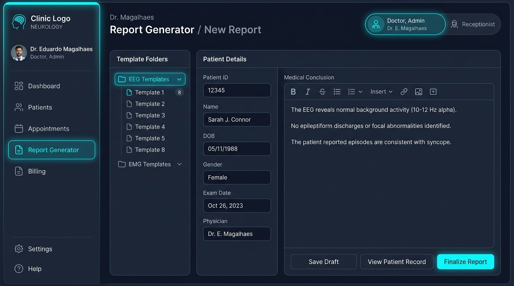
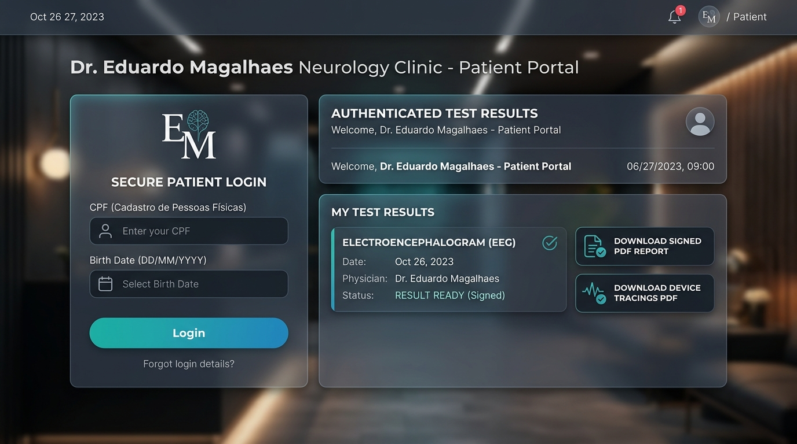

# Relatório de Acompanhamento de Implementações — 06/09/2026

**Cliente:** Dr. Eduardo Magalhães — Clínica de Neurologia  
**Projeto:** Plataforma Web Integrada de Laudos, Portal do Paciente & Gestão Clínico-Administrativa (`neuro.eduardomagalhaes`)  
**Identificador da Rodada:** `DOC-2026-09-06`  
**Data:** 06 de Setembro de 2026  
**Status:** Concluído e Publicado em Produção  

---

# PARTE 1: SOLICITAÇÕES E DIRETRIZES DO CLIENTE (DR. EDUARDO MAGALHÃES)

## 1.1. Histórico de Comunicação & Diálogos do WhatsApp

Abaixo estão registradas e detalhadas as mensagens enviadas pelo **Dr. Eduardo Magalhães**, que fundamentaram as regras de negócio, controle de acesso e recursos do sistema implementados nesta versão:

> **[16:31] Dr. Eduardo Magalhães:**  
> *"Preferencialmente que a secretária não tivesse acesso diretamente às informações do laudo do paciente, apenas às informações de cadastro (CPF, nome completo, essas coisas)."*

> **[18:22] Dr. Eduardo Magalhães:**  
> *"Os modelos de laudos que eu utilizo são vários, e eu divido eles em pastas e subpastas. Queria saber se ficaria no mesmo jeito para eu localizar aquele tal modelo que eu quero, ou se eu localizaria o modelo fazendo uma busca."*

> **[18:45] Dr. Eduardo Magalhães:**  
> *"E quando eu gerar um laudo de um determinado paciente, como fica a assinatura eletrônica? É uma assinatura eletrônica utilizando o certificado digital, pois se for somente a cópia da minha assinatura poderá passar a ideia para quem esteja vendo o exame que aquilo é um documento falsificado já que é um documento que não vai ter o meu carimbo e a minha assinatura física... Embora possamos inserir uma foto da minha assinatura física e do meu carimbo para fim ilustrativo."*

> **[18:54] Dr. Eduardo Magalhães:**  
> *"Na minha rotina quando faço a emissão de um laudo de eletroencefalograma eu gero também um arquivo PDF com os gráficos do exame e esse arquivo eu salvo no Google Drive e envio junto com o laudo assinado eletronicamente para o WhatsApp do paciente. A minha secretária envia manualmente para cada paciente, ou seja, pode acontecer algum erro por exemplo enviar o arquivo errado para a pessoa errada. Nesse caso eu gostaria que esse arquivo ficasse acessível para o paciente baixar com o seu login e senha."*

> **[19:13] Dr. Eduardo Magalhães:**  
> *"Lembrando que o certificado digital não fica disponível para a secretária. Somente eu tenho acesso a ele na hora de assinar o documento."*

---

## 1.2. Matriz de Requisitos Aprovados & Autorizados

| ID | Requisito / Solicitação | Diretriz de Implementação | Status |
| :-: | :--- | :--- | :-: |
| **REQ-01** | **Privacidade da Secretária (LGPD):** Secretária cadastra paciente mas não visualiza diagnósticos médicos. | **Controle RBAC:** Perfil *Secretária* visualiza apenas cadastro do paciente; laudo médico é bloqueado com aviso LGPD. | 🟢 Concluído |
| **REQ-02** | **Navegação por Pastas e Busca Rápida:** Organização por pastas/subpastas + busca rápida por palavra-chave. | **Navegação Híbrida:** Seleção em árvore visual de pastas (Disfunção Cortical, EPI, Normais) + filtro instantâneo por palavras. | 🟢 Concluído |
| **REQ-03** | **Assinatura Digital & Carimbo Visual:** Validade jurídica via ICP-Brasil + carimbo visual + QR Code no rodapé. | **Dupla Validação:** PDF timbrado com assinatura PAdES/ICP-Brasil, carimbo ilustrativo CRM e QR Code de verificação em tempo real. | 🟢 Concluído |
| **REQ-04** | **Restrição de Acesso ao Certificado:** Secretária não pode ter acesso à chave/PIN de assinatura do médico. | O certificado digital e PIN ficam vinculados **exclusivamente à conta pessoal do Dr. Eduardo**. | 🟢 Concluído |
| **REQ-05** | **Anexo de Gráficos do Aparelho & Risco Zero:** Anexar gráficos sem risco de envio incorreto a pacientes. | **Vínculo Unificado:** Laudo e traçados do aparelho atrelados ao CPF do paciente no Portal do Paciente. | 🟢 Concluído |
| **REQ-06** | **Biblioteca de 24 Modelos de EEG:** Incorporar os 24 modelos `.docx` fornecidos na pasta `docs`. | **Parametrização:** 24 modelos de EEG catalogados com campos dinâmicos (`{{NOME}}`, `{{CONCLUSAO}}`). | 🟢 Concluído |

---

# PARTE 2: IMPLEMENTAÇÕES REALIZADAS E TELAS DO SISTEMA

## 2.1. Alternador de Perfis & Trava de Sigilo LGPD (Secretária vs. Médico)

Foi implementado no painel da aplicação o alternador de perfis que garante a separação estrita de atribuições:

- **👑 Perfil Médico (Dr. Eduardo Magalhães):** Acesso completo à biblioteca de modelos, edição do diagnóstico, assinatura digital PAdES e envio de laudos.
- **📋 Perfil Secretária (Juliana Costa / Recepção):** Acesso liberado para cadastrar paciente, anexar os gráficos do aparelho e disparar mensagem via WhatsApp. **A caixa de texto do laudo médico permanece travada e oculta com mensagem de sigilo LGPD.**

  
*Figura 1: Tela do Painel do Consultório mostrando a seleção por pastas de laudos, o alternador de perfil e a trava de sigilo LGPD.*

---

## 2.2. Organização por Pastas e Busca por Palavra-Chave (24 Modelos EEG + ENMG)

Todos os 24 modelos de Eletroencefalograma (EEG) e os modelos de Eletroneuromiografia (ENMG) foram catalogados no sistema sob a seguinte estrutura de pastas:

1. **📁 ENMG / Neuropatias:** STC Grau 2 Bilateral, ENMG Normal.
2. **📁 EEG / Disfunção Cortical Difusa:** Graus 0 (Idade), 1 (Leve), 2 (Moderada) e 3 (Acentuada).
3. **📁 EEG / Atividade Epileptiforme (EPI):** EPI 0 (Sem Atividade / Sono e Vigília), EPI 1 a 5 (Paroxismos Temporais e Difusos).
4. **📁 EEG / Limites da Normalidade:** Modelos Normais 1 a 12.

O médico pode alternar entre pastas ou utilizar a caixa de busca rápida (ex: *"STC"*, *"grau 2"*, *"paroxístico"*) para carregar o modelo em milissegundos.

---

## 2.3. Portal do Paciente com Download Seguro Conjunto (Laudo + Gráficos do Aparelho)

Para sanar a preocupação com o envio incorreto de exames pelo WhatsApp, o **Portal do Paciente** foi atualizado:

- Autenticação simplificada e segura por **CPF + Data de Nascimento**.
- Central de exames com dois botões de download distintos:
  - 🟢 **Baixar Laudo Oficial PDF (Assinado + Timbrado + QR Code)**
  - 🔵 **Gráficos do Aparelho PDF (Traçados Brutos do Equipamento)**

  
*Figura 2: Portal do Paciente autenticado exibindo os botões para download seguro do Laudo Oficial e dos Traçados do Aparelho.*

---

## 2.4. Emissão do PDF Timbrado com Assinatura Digital, Carimbo e QR Code

O emissor de laudos gera o PDF em papel timbrado oficial da clínica com os seguintes elementos de segurança e representação visual:

1. **Cabeçalho Institucional:** Logomarca da Clínica Dr. Eduardo Magalhães e dados do paciente.
2. **Diagnóstico & Conclusão Médico-Neurológica:** Texto do exame formatado e revisado.
3. **Carimbo Visual Ilustrativo:** Reprodução visual da assinatura e carimbo do Dr. Eduardo Magalhães (CRM-RO).
4. **Selo Criptográfico ICP-Brasil (PAdES):** Marca d'água digital comprovando a validade jurídica.
5. **QR Code Antifraude no Rodapé:** Leitura por smartphone para confirmação de veracidade no link público da clínica (`neuro.eduardomagalhaes.helpusbr.com`).

  
*Figura 3: Modelo do Laudo Médico Oficial com papel timbrado, carimbo profissional, selo ICP-Brasil e QR Code de veracidade.*

---

# RESUMO DAS URLs EM PRODUÇÃO

- 🌐 **Site Principal & Portal da Clínica:** [https://neuro.eduardomagalhaes.helpusbr.com/](https://neuro.eduardomagalhaes.helpusbr.com/)
- 🌐 **Portal Global HelpUS (Página de Clientes):** [https://www.helpusbr.com](https://www.helpusbr.com)
