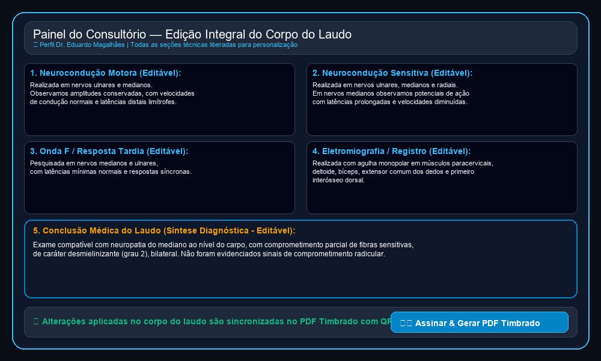
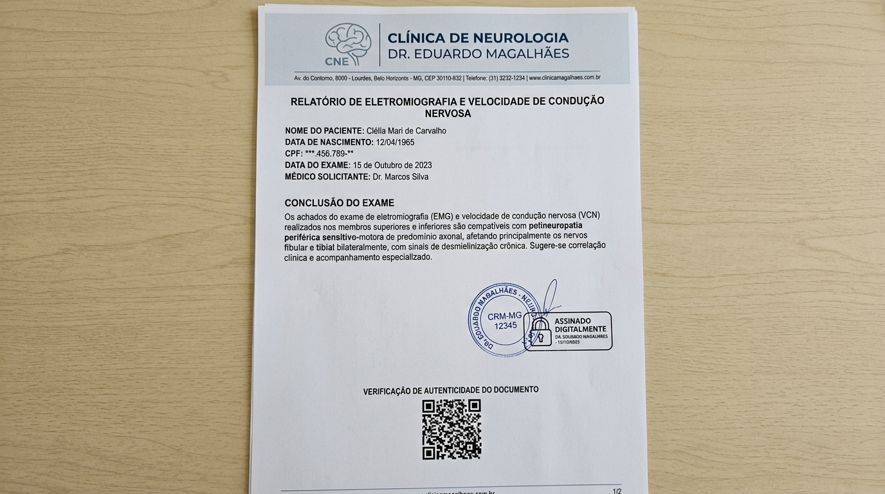

# Relatório de Acompanhamento & Roteiro de Uso — 15/09/2026

**Cliente:** Dr. Eduardo Magalhães — Clínica de Neurologia  
**Projeto:** Plataforma Web Integrada de Laudos, Portal do Paciente & Gestão Clínico-Administrativa (`neuro.eduardomagalhaes`)  
**Identificador da Rodada:** `DOC-2026-09-15`  
**Data:** 15 de Setembro de 2026  
**Status:** Concluído, Compilado e Publicado em Produção  
**Links de Produção:** [https://neuro.eduardomagalhaes.helpusbr.com/](https://neuro.eduardomagalhaes.helpusbr.com/) | [https://www.helpusbr.com](https://www.helpusbr.com)

---

# PARTE 1: SOLICITAÇÕES E DIRETRIZES DO CLIENTE (DR. EDUARDO MAGALHÃES)

## 1.1. Histórico de Comunicação & Diálogos do WhatsApp (15/09/2026)

Abaixo está registrada a nova mensagem enviada pelo **Dr. Eduardo Magalhães** referente à personalização integral do corpo dos laudos médicos:

> **[19:02] Dr. Eduardo Magalhães:**  
> *"E aí Wagner, tudo bem? Verifiquei agora o site, vi que a estrutura das pastas e arquivos foi colocada. Entretanto, ao selecionar um modelo especifico de laudo, aparece a opção de editar o campo da conclusão, mas seria importante que eu pudesse editar também as demais informações do corpo do laudo, pois rotineiramente faço isso."*

---

## 1.2. Matriz de Requisitos Aprovados & Autorizados (Rodada 15/09/2026)

| ID | Requisito / Solicitação | Diretriz de Implementation | Status |
| :-: | :--- | :--- | :-: |
| **REQ-11** | **Edição Integral do Corpo do Laudo Médico:** Permitir editar Neurocondução Motora, Sensitiva, Onda F, Eletromiografia e Conclusão. | **Formulário de Edição Completa:** Adição de 5 caixas de texto (`textarea`) no perfil do médico para personalização irrestrita do corpo do exame antes da assinatura. | 🟢 Concluído |

---

# PARTE 2: IMPLEMENTAÇÕES E COMPONENTES DESENVOLVIDOS

## 2.1. Liberdade de Edição Integral do Corpo Diagnóstico (Dr. Eduardo)

Foi atualizada no emissor de laudos a estrutura do corpo médico do exame:

1. ⚡ **1. Neurocondução Motora:** Caixa de texto editável com o texto padrão do modelo selecionado, liberada para ajustes de amplitudes, latências e velocidades.
2. 🧠 **2. Neurocondução Sensitiva:** Caixa de texto editável para personalizar dados sensitivos de nervos testados.
3. 📈 **3. Onda F / Resposta Tardia:** Caixa de texto editável para registro de respostas tardias e frequências.
4. 🔬 **4. Eletromiografia / Registro Cerebral:** Caixa de texto editável para relatar musculatura avaliada e atividade espontânea.
5. 🎯 **5. Conclusão Médica do Laudo:** Caixa de síntese diagnóstica em destaque para revisão do médico.

---

## 2.2. Sincronização Automática com o PDF Timbrado & Validação Criptográfica

Todas as edições realizadas pelo Dr. Eduardo em qualquer um dos 5 blocos do corpo do laudo são **refletidas instantaneamente no PDF Timbrado** gerado pelo sistema:
- Mantidos o papel timbrado da Clínica Dr. Eduardo Magalhães, carimbo profissional com CRM-RO, selo de assinatura digital ICP-Brasil (PAdES) e o QR Code antifraude no rodapé.
- Mantida a trava de sigilo médico LGPD para o perfil **Secretária (Recepção)**.

---

# PARTE 3: ROTEIRO PASSO A PASSO DE USO (EDITION INTEGRAL DO LAUDO)

Abaixo demonstra-se como o Dr. Eduardo pode navegar no painel e personalizar integralmente o corpo do exame:

### 1️⃣ Passo 1: Autenticação & Seleção do Modelo por Pastas (Drive)
1. Acesse o site oficial: [https://neuro.eduardomagalhaes.helpusbr.com/](https://neuro.eduardomagalhaes.helpusbr.com/)
2. Faça login com o perfil do **Dr. Eduardo Magalhães** (`eduardo@clinica.com.br` / `123`).
3. Navegue pela árvore de pastas e clique no modelo desejado (ex: *ENMG - STC Grau 2 Bilateral* ou *EEG - Disfunção Cortical*).

---

### 2️⃣ Passo 2: Edição dos 5 Blocos do Corpo do Laudo Técnico
1. Abaixo dos dados do paciente, localize o painel **"Edição Integral do Corpo do Laudo Técnico & Diagnóstico"**.
2. Modifique livremente o texto das caixas de:
   - `1. Neurocondução Motora`
   - `2. Neurocondução Sensitiva`
   - `3. Onda F / Resposta Tardia`
   - `4. Eletromiografia / Registro Cerebral`
   - `5. Conclusão Médica do Laudo`

  
*Figura 1: Nova Tela do Painel exibindo a edição integral de todas as seções do corpo do laudo médico no perfil do Dr. Eduardo.*

---

### 3️⃣ Passo 3: Geração do PDF Timbrado com Assinatura & QR Code
1. Clique no botão **"Assinar & Gerar PDF Timbrado"**.
2. O PDF será baixado contendo todas as alterações personalizadas no corpo do documento com o carimbo profissional e o QR Code de validação.

  
*Figura 2: Modelo do Laudo Médico Oficial com papel timbrado, carimbo profissional, selo ICP-Brasil e QR Code de validação.*

---

# RESUMO DAS URLs EM PRODUÇÃO

- 🌐 **Site Principal & Portal da Clínica:** [https://neuro.eduardomagalhaes.helpusbr.com/](https://neuro.eduardomagalhaes.helpusbr.com/)
- 🌐 **Portal Global HelpUS (Página de Clientes):** [https://www.helpusbr.com](https://www.helpusbr.com)
