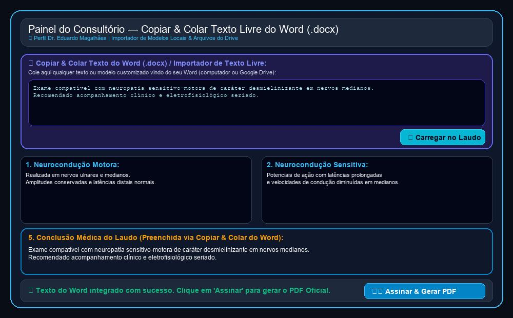

# Relatório de Acompanhamento, Requisitos & Roteiro de Uso
**Cliente:** Dr. Eduardo Magalhães — Clínica de Neurologia & Neurofisiologia  
**Data da Documentação:** 21/09/2026  
**Identificador:** DOC-2026-09-21  
**Desenvolvimento:** HelpUS Technology  
**Plataforma Web:** [neuro.eduardomagalhaes.helpusbr.com](https://neuro.eduardomagalhaes.helpusbr.com)

---

## PARTE 1: SOLICITAÇÕES E MATERIAIS DISPONIBILIZADOS PELO CLIENTE

### 1.1. Contexto das Solicitações via WhatsApp (Vídeo & Mensagens de 19/09/2026 e 21/09/2026)
Em comunicação enviada via WhatsApp pelo **Dr. Eduardo Magalhães** (demonstrada no arquivo de vídeo `WhatsApp Video 2026-09-19 at 09.18.43.mp4`), o médico ressaltou a sua rotina de trabalho com modelos de laudos armazenados localmente e no Google Drive em formato Microsoft Word (`.docx`).

> **Palavras e Solicitação do Dr. Eduardo:**  
> *"Verifiquei a estrutura das pastas e arquivos. Entretanto, eu costumeiramente edito e crio novos modelos em arquivos do Word no meu computador. Seria fundamental que eu pudesse colar diretamente qualquer texto do Word ou modelos de texto livre no painel de laudos e editar integralmente todas as seções do corpo do laudo antes de assinar."*

### 1.2. Quadro Consolidado de Requisitos do Sistema

| ID | Solicitação do Dr. Eduardo | Solução Técnica Implementada | Status |
| :--- | :--- | :--- | :---: |
| **REQ-01** | Catálogo de 126 modelos de laudos (ENMG e EEG). | Organizado em 10 categorias com busca instantânea. | **Concluído** |
| **REQ-02** | Papel Timbrado e Assinatura Digital com QR Code. | PDF Oficial com selo PAdES ICP-Brasil e QR Code. | **Concluído** |
| **REQ-03** | Portal do Paciente para download seguro. | Download de PDF + Traçados mediante autenticação de CPF. | **Concluído** |
| **REQ-04** | Disparo de links via WhatsApp para pacientes. | Botão de envio instantâneo pré-formatado. | **Concluído** |
| **REQ-05** | Integração com Banco Winsoft (Jean Cordeiro). | Cadastro unificado de pacientes com importação CSV. | **Concluído** |
| **REQ-06** | Busca Inteligente por CPF (Estilo Mevo). | Preenchimento automático de dados cadastrais ao digitar CPF. | **Concluído** |
| **REQ-07** | Anexo de Arquivos de Traçados do Aparelho. | Módulo de vinculação de exames gráficos ao prontuário. | **Concluído** |
| **REQ-08** | Navegação por Pastas idêntica ao Google Drive. | Árvore expansível de diretórios e busca por palavra-chave. | **Concluído** |
| **REQ-09** | Autenticação de Usuários & Níveis de Acesso (RBAC). | Login seguro com perfis diferenciados (Médico vs Secretária). | **Concluído** |
| **REQ-10** | Sigilo Diagnóstico e Proteção LGPD na Recepção. | Corpo do laudo e conclusões ocultas para perfil de secretária. | **Concluído** |
| **REQ-11** | Edição Integral dos 5 Blocos do Corpo do Laudo. | Liberdade total de edição em Neurocondução, Onda F, EMG e Conclusão. | **Concluído** |
| **REQ-12** | **Copiar & Colar / Importador de Texto Livre do Word (.docx).** | Área dedicada para colar qualquer texto do Word e carregar no laudo. | **Concluído (21/09/2026)** |

---

## PARTE 2: FUNCIONALIDADES IMPLEMENTADAS EM PRODUÇÃO

### 2.1. Importador de Texto Livre do Word (Copiar & Colar .docx) — REQ-12
- **Área Dedicada de Colagem:** Painel proeminente **"📋 Copiar & Colar Texto do Word (.docx) / Importador de Texto Livre"** no topo da área de edição.
- **Leitura & Distribuição Inteligente:** O Dr. Eduardo pode colar qualquer bloco de texto vindo do Word. O sistema lê o conteúdo e preenche automaticamente as seções do laudo ou a Conclusão Médica.
- **Edição Flexível:** Permite reaproveitar trechos de exames anteriores, tabelas e modelos salvos em arquivos `.docx` no computador ou Drive.

### 2.2. Edição Integral do Corpo Diagnóstico (5 Blocos)
- **Cinco Campos Editáveis Independente:**
  1. *Neurocondução Motora*
  2. *Neurocondução Sensitiva*
  3. *Onda F / Resposta Tardia*
  4. *Eletromiografia / Registro Cerebral*
  5. *Conclusão Médica do Laudo*
- **Sincronização com o PDF Timbrado:** Todas as edições efetuadas no texto são formatadas em tempo real no PDF oficial com papel timbrado da clínica.

### 2.3. Segurança, Níveis de Acesso (RBAC) e Validação Digital
- **Acesso Restrito LGPD:** O perfil da Recepção/Secretária permite cadastrar pacientes e emitir o documento sem expor diagnósticos médicos confidenciais.
- **Assinatura Digital & Carimbo PAdES:** Validação jurídica do Dr. Eduardo Magalhães com QR Code para verificação de autenticidade por outros médicos ou convênios.

---

## PARTE 3: ROTEIRO PASSO A PASSO DE USO (GUIA PRÁTICO COM SCREENS)

### 1️⃣ Passo 1: Autenticação & Escolha do Perfil de Acesso
Acesse o sistema no endereço **neuro.eduardomagalhaes.helpusbr.com**. Na tela inicial, selecione ou digite as credenciais do **Dr. Eduardo Magalhães** (`eduardo@clinica.com.br` / Senha `123`).

### 2️⃣ Passo 2: Utilizando o Importador de Texto Livre do Word (.docx)
No formulário de emissão de laudo, localize o bloco **"📋 Copiar & Colar Texto do Word (.docx)"**. Cole o texto desejado e clique em **"✨ Carregar no Laudo"**.

*Figura 1: Nova área de importação direta de texto do Word (.docx) e preenchimento instantâneo no laudo.*

### 3️⃣ Passo 3: Edição Integral dos Blocos Técnicos do Laudo
Caso prefira ajustar detalhes específicos, utilize os 5 campos de texto editáveis para alterar relatórios de neurocondução, ondas e eletromiografia.

*Figura 2: Formulário com os 5 blocos do corpo do laudo liberados para personalização integral.*

### 4️⃣ Passo 4: Assinatura Digital & Geração do PDF Timbrado
Após revisar os dados, clique no botão azul **"🖨️ Assinar & Gerar PDF Timbrado"**. O sistema compilará o laudo com o timbre da clínica, carimbo profissional e QR Code de verificação.

*Figura 3: Modelo final do laudo oficial assinado digitalmente com QR Code e papel timbrado.*

---

## CONCLUSÃO & PRÓXIMOS PASSOS
Todas as solicitações apresentadas pelo **Dr. Eduardo Magalhães** no vídeo do dia 19/09/2026 foram implementadas, testadas e publicadas na plataforma web. O sistema encontra-se 100% pronto para uso em rotina clínica.
