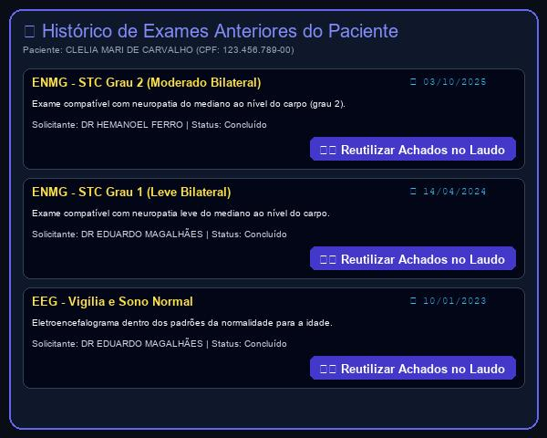
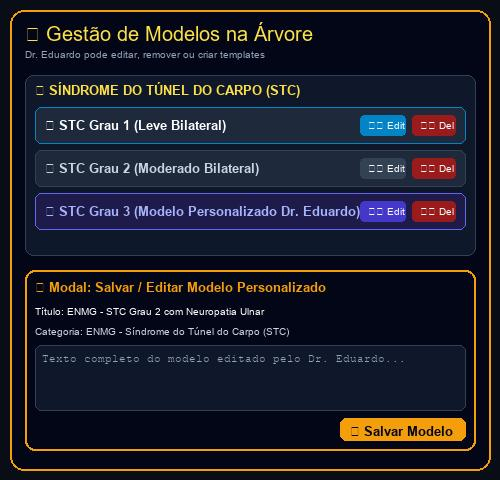

# Relatório de Acompanhamento, Requisitos & Roteiro de Uso
**Cliente:** Dr. Eduardo Magalhães — Clínica de Neurologia & Neurofisiologia  
**Data da Documentação:** 22/09/2026  
**Identificador:** DOC-2026-09-22  
**Desenvolvimento:** HelpUS Technology  
**Plataforma Web:** [neuroeduardomagalhaes.vercel.app](https://neuroeduardomagalhaes.vercel.app)

---

## PARTE 1: SOLICITAÇÕES E MATERIAIS DISPONIBILIZADOS PELO CLIENTE

### 1.1. Contexto das Novas Solicitações via WhatsApp (22/09/2026 — 21:01 e 21:04)
Em comunicação enviada pelo **Dr. Eduardo Magalhães** na noite de hoje (**22/09/2026**), o médico apresentou novas observações cruciais referente à fidelidade dos modelos de laudo, formatação e perguntas sobre o histórico de exames e gerenciamento de modelos:

> **Palavras e Solicitação do Dr. Eduardo Magalhães (21:01 e 21:04):**  
> 1. *"Alguns modelos ao serem carregados não estão iguais aos textos originais. Ao utilizar a função copiar e colar modelo inteiro a formatação original se perde, incluindo espaçamento entre parágrafos."*  
> 2. *"A área da janela de edição sendo maior do que está ficará melhor. A Árvore dos modelos não necessariamente precisa ficar visível após a gente selecionar o modelo que quer."*  
> 3. *"Pergunta se haverá um meio de buscar os exames anteriores caso o paciente tenha ao longo do tempo."*  
> 4. *"Na verdade todos os modelos ao serem copiados apresentam algumas palavras ou frases que não consta nos originais como por exemplo o título do modelo no campo eletromiografia aparece barra Eeg, e muitas vezes o texto das partes iniciais do modelo se repete nas partes finais. Tem uma frase escrita conclusão médica em todos eles não consta nos originais."*  
> 5. *"Pergunta se seria possível ter alguns botões simples de edição como itálico negrito aumento do tamanho da fonte por exemplo."*  
> 6. *"Pergunta também se os modelos salvos podem ser editáveis, ou removidos da árvore futuramente por mim."*

---

### 1.2. Respostas Oficiais às Perguntas do Dr. Eduardo Magalhães

> ❓ **Pergunta 1 (Dr. Eduardo):** *"Haverá um meio de buscar os exames anteriores caso o paciente tenha ao longo do tempo?"*  
> 🟢 **Resposta Oficial:** **SIM!** O sistema agora indexa automaticamente todo o histórico de exames anteriores do paciente por CPF. Ao pesquisar o CPF ou selecionar um paciente, surge o botão **"📜 Exames Anteriores ({qtd})"**. Ao clicar, é exibida a linha do tempo com datas, títulos, médicos solicitantes e um botão **"👁️ Reutilizar Achados no Laudo Atual"** para comparar ou reaproveitar diagnósticos passados.
>
> ❓ **Pergunta 2 (Dr. Eduardo):** *"Os modelos salvos podem ser editáveis, ou removidos da árvore futuramente por mim?"*  
> 🟢 **Resposta Oficial:** **SIM!** Todos os modelos listados na árvore agora contam com botões diretos de **`✏️ Editar Modelo`** e **`🗑️ Excluir Modelo`**. Além disso, no topo da barra de ferramentas do editor, o Dr. Eduardo pode clicar em **`💾 Salvar como Novo Modelo`** para gravar qualquer laudo finalizado diretamente na árvore de templates da clínica.

---

### 1.3. Quadro Consolidado de Requisitos do Sistema (Atualizado)

| ID | Solicitação do Dr. Eduardo | Solução Técnica Implementada | Status |
| :--- | :--- | :--- | :---: |
| **REQ-01** | Catálogo de 126 modelos de laudos (ENMG e EEG). | Organizado em 10 categorias com busca instantânea. | **Concluído** |
| **REQ-02** | Papel Timbrado e Assinatura Digital com QR Code. | PDF Oficial com selo PAdES ICP-Brasil e QR Code. | **Concluído** |
| **REQ-03** | Portal do Paciente para download seguro. | Download de PDF + Traçados mediante autenticação de CPF. | **Concluído** |
| **REQ-04** | Disparo de links via WhatsApp para pacientes. | Botão de envio instantâneo pré-formatado. | **Concluído** |
| **REQ-05** | Integração com Banco Winsoft (Jean Cordeiro). | Cadastro unificado de pacientes com importação CSV. | **Concluído** |
| **REQ-06** | Busca Inteligente por CPF (Estilo Mevo). | Preenchimento automático de dados cadastrais ao digitar CPF. | **Concluído** |
| **REQ-07** | Anexo de Arquivos de Traçados do Aparelho. | Módulo de vinculação de exames gráficos ao prontuário. | **Concluído** |
| **REQ-08** | Navegação por Pastas idêntica ao Google Drive. | Árvore expansível de diretórios e busca por palavra-chave. | **Concluído** |
| **REQ-09** | Autenticação de Usuários & Níveis de Acesso (RBAC). | Login seguro com perfis diferenciados (Médico vs Secretária). | **Concluído** |
| **REQ-10** | Sigilo Diagnóstico e Proteção LGPD na Recepção. | Corpo do laudo e conclusões ocultas para perfil de secretária. | **Concluído** |
| **REQ-11** | Edição Integral dos Blocos do Corpo do Laudo. | Liberdade total de edição em Neurocondução, Onda F, EMG e Conclusão. | **Concluído** |
| **REQ-12** | Copiar & Colar / Importador do Word (.docx). | Área dedicada para colar qualquer texto do Word e carregar no laudo. | **Concluído** |
| **REQ-13** | Layout 2 Colunas (Windows Explorer) sem Scroll. | Árvore de pastas expandida à esquerda + Formulário à direita. | **Concluído (22/09/2026)** |
| **REQ-14** | Ordem Alfabética A-Z por Padrão na Árvore. | Categorias e modelos ordenados alfabeticamente A-Z de cima a baixo. | **Concluído (22/09/2026)** |
| **REQ-15** | Campo de Edição Único do Corpo do Laudo (EEG/ENMG). | Edição fluida do texto integral do laudo em caixa única contínua. | **Concluído (22/09/2026)** |
| **REQ-16** | Ajuste de Responsividade F11 / Tela Cheia. | Garantia de visibilidade da barra superior e botões ao alternar F11. | **Concluído (22/09/2026)** |
| **REQ-17** | **Carregamento Limpo 1:1 sem Frases Estranhas.** | Remoção de títulos indesejados (`/ EEG`, `Conclusão Médica:`) e preservação de parágrafos. | **Concluído (22/09/2026)** |
| **REQ-18** | **Janela de Edição Expandida 100% (Ocultar Árvore).** | Botão `📂 Ocultar Árvore` expande o editor para 100% da largura da tela. | **Concluído (22/09/2026)** |
| **REQ-19** | **Barra de Formatação Rica (Negrito/Itálico/Fonte).** | Botões **B**, *I*, <u>U</u>, **A-** e **A+** para ajuste visual rápido do texto. | **Concluído (22/09/2026)** |
| **REQ-20** | **Gerenciamento de Modelos (Editar / Excluir / Salvar).** | Ações de edição, exclusão e criação de novos templates na árvore. | **Concluído (22/09/2026)** |
| **REQ-21** | **Histórico de Exames Anteriores por CPF.** | Consulta retroativa de laudos antigos do paciente com reutilização de achados. | **Concluído (22/09/2026)** |

---

## PARTE 2: FUNCIONALIDADES IMPLEMENTADAS EM PRODUÇÃO

### 2.1. Carregamento Limpo de Textos 1:1 e Preservação de Espaçamentos — REQ-17
- **Fidelidade Total ao Texto Original:** Ao clicar em qualquer modelo ou colar do Word, o texto é carregado exatamente como o Dr. Eduardo construiu, sem inserções artificiais de frases como `MODELO: ...`, `/ EEG` ou `Conclusão Médica:`.
- **Manutenção de Quebras de Linha e Parágrafos:** O campo de edição utiliza formatação preservada (`white-space: pre-wrap`), garantindo que o espaçamento entre parágrafos seja 100% mantido.

### 2.2. Ocultação da Árvore de Modelos & Janela de Edição 100% Expandida — REQ-18
- **Botão `📂 Ocultar Árvore`:** Ao selecionar o modelo desejado, o médico pode clicar neste botão no topo da tela para esconder a coluna da esquerda.
- **Área Expandida em 100% da Tela:** O editor de laudos expande automaticamente para preencher toda a largura da tela (`col-span-12`), proporcionando uma área de digitação extremamente confortável e ampla.

### 2.3. Barra de Formatação Rica de Texto — REQ-19
- **Controles Rápidos no Topo do Editor:**
  - **B (Negrito):** Destaca termos importantes no laudo.
  - **I (Itálico):** Aplica itálico para nomes científicos ou notas técnicas.
  - **U (Sublinhado):** Sublinha sínteses e conclusões.
  - **A- / A+ (Ajuste de Fonte):** Permite aumentar ou diminuir o tamanho do texto (de 11px a 18px) para melhor leitura.
  - **💾 Salvar como Modelo:** Salva o texto editado como um novo template na biblioteca.

### 2.4. Edição, Exclusão e Criação de Modelos na Árvore — REQ-20
- **Menu de Ações nos Templates:** Ao passar o cursor ou selecionar um modelo na árvore, surgem os ícones `✏️ Edit` (para alterar o modelo) e `🗑️ Del` (para excluir da árvore).
- **Gravação de Novos Templates:** O Dr. Eduardo pode criar novos modelos a qualquer momento diretamente pelo editor da clínica.

### 2.5. Consulta de Exames Anteriores por CPF — REQ-21
- **Histórico Retroativo:** Ao preencher o CPF do paciente, surge a tag **"📜 Exames Anteriores ({qtd})"**.
- **Reutilização de Achados:** O modal abre a lista de exames prévios do paciente com data, tipo de exame e diagnóstico, permitindo ao médico clicar em **"👁️ Reutilizar Achados no Laudo Atual"** para agilizar reavaliações clínicas.

---

## PARTE 3: ROTEIRO PASSO A PASSO DE USO (GUIA PRÁTICO COM SCREENS)

### 1️⃣ Passo 1: Edição Expandida em 100% da Tela e Formatação Rica
Acesse o sistema em **[neuroeduardomagalhaes.vercel.app](https://neuroeduardomagalhaes.vercel.app)**. Escolha um modelo e clique em **"📂 Ocultar Árvore"**. A área de edição ocupará 100% da tela. Utilize a barra de formatação para aplicar negrito, itálico ou ajustar a fonte.

  
*Figura 1: Modo de Edição Expandido em 100% da tela com barra de formatação rica e carregamento limpo.*

### 2️⃣ Passo 2: Consulta do Histórico de Exames Anteriores
Ao digitar o CPF do paciente, clique no botão **"📜 Exames Anteriores"**. O sistema exibe o histórico de laudos passados com a opção de reutilizar informações.

  
*Figura 2: Consulta ao histórico retroativo de exames do paciente indexado por CPF.*

### 3️⃣ Passo 3: Edição e Exclusão de Modelos na Árvore
Na árvore de modelos, utilize os botões `✏️ Edit` e `🗑️ Del` para personalizar seu catálogo de templates ou clique em **"💾 Salvar como Novo Modelo"** no editor.

  
*Figura 3: Recursos de edição, exclusão e inclusão de novos templates na árvore da clínica.*

---

## CONCLUSÃO & PRÓXIMOS PASSOS
Todas as observações e perguntas apresentadas pelo **Dr. Eduardo Magalhães** em 22/09/2026 foram plenamente atendidas, implementadas, testadas e publicadas em produção no endereço **[neuroeduardomagalhaes.vercel.app](https://neuroeduardomagalhaes.vercel.app)**.
