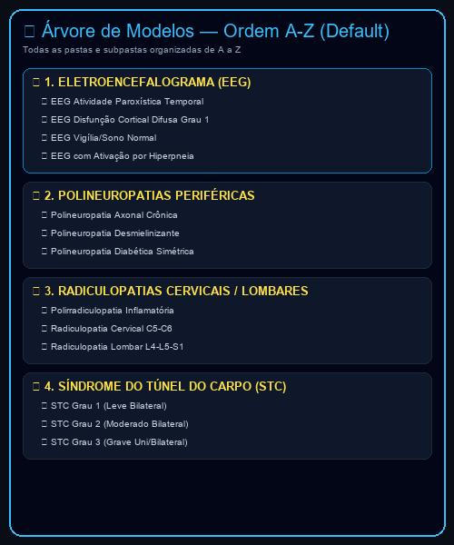
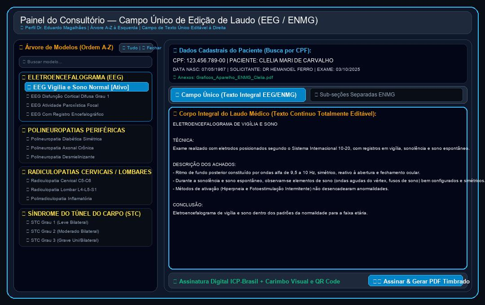

# Relatório de Acompanhamento, Requisitos & Roteiro de Uso
**Cliente:** Dr. Eduardo Magalhães — Clínica de Neurologia & Neurofisiologia  
**Data da Documentação:** 22/09/2026  
**Identificador:** DOC-2026-09-22  
**Desenvolvimento:** HelpUS Technology  
**Plataforma Web:** [neuroeduardomagalhaes.vercel.app](https://neuroeduardomagalhaes.vercel.app)

---

## PARTE 1: SOLICITAÇÕES E MATERIAIS DISPONIBILIZADOS PELO CLIENTE

### 1.1. Contexto das Solicitações via WhatsApp (22/09/2026)
Em comunicação enviada pelo **Dr. Eduardo Magalhães** na data de hoje (**22/09/2026**), o médico enviou novas observações sobre a usabilidade da árvore de modelos, a edição do texto do laudo e o comportamento da tela em F11 (Fullscreen):

> **Palavras e Solicitação do Dr. Eduardo Magalhães:**  
> 1. *"A árvore de modelos de templates fica melhor se ela ficar por default em ordem alfabética de cima a baixo e também é o que acontece quando abre a pasta eletroencefalograma..."*  
> 2. *"Eu acho que ficaria mais prático que fosse ao clicar num determinado modelo abrisse um campo de edição único onde pudesse ser editado pelo texto por inteiro. O modo como está dividido em sub campos (1. neurocondução motora, 2. neurocondução sensitiva, 3. onda f, 4. eletromiografia) pode acabar se tornando mais trabalhoso na prática."*  
> 3. *"Ao utilizar o comando f11 para tela cheia a tela aparece inteira, mas ao voltar para tela normal a parte superior da tela não aparece."*

---

### 1.2. Quadro Consolidado de Requisitos do Sistema

| ID | Solicitação do Dr. Eduardo | Solução Técnica Implementada | Status |
| :--- | :--- | :--- | :---: |
| **REQ-01** | Catálogo de 126 modelos de laudos (ENMG e EEG). | Organizado em 10 categorias com busca instantânea. | **Concluído** |
| **REQ-02** | Papel Timbrado e Assinatura Digital com QR Code. | PDF Oficial com selo PAdES ICP-Brasil e QR Code. | **Concluído** |
| **REQ-03** | Portal do Paciente para download seguro. | Download de PDF + Traçados mediante autenticação de CPF. | **Concluído** |
| **REQ-04** | Disparo de links via WhatsApp para pacientes. | Botão de envio instantâneo pré-formatado. | **Concluído** |
| **REQ-05** | Integração com Banco Winsoft (Jean Cordeiro). | Cadastro unificado de pacientes com importação CSV. | **Concluído** |
| **REQ-06** | Busca Inteligente por CPF (Estilo Mevo). | Preenchimento automático de dados cadastrais ao digitar CPF. | **Concluído** |
| **REQ-07** | Anexo de Arquivos de Traçados do Aparelho. | Módulo de vinculação de exames gráficos ao prontuário. | **Concluído** |
| **REQ-08** | Navegação por Pastas idêntica ao Google Drive. | Árvore expansível de diretórios e busca por palavra-chave. | **Concluído** |
| **REQ-09** | Autenticação de Usuários & Níveis de Acesso (RBAC). | Login seguro com perfis diferenciados (Médico vs Secretária). | **Concluído** |
| **REQ-10** | Sigilo Diagnóstico e Proteção LGPD na Recepção. | Corpo do laudo e conclusões ocultas para perfil de secretária. | **Concluído** |
| **REQ-11** | Edição Integral dos Blocos do Corpo do Laudo. | Liberdade total de edição em Neurocondução, Onda F, EMG e Conclusão. | **Concluído** |
| **REQ-12** | Copiar & Colar / Importador de Texto Livre do Word (.docx). | Área dedicada para colar qualquer texto do Word e carregar no laudo. | **Concluído** |
| **REQ-13** | **Layout 2 Colunas (Windows Explorer) sem Scroll.** | Árvore de pastas expandida à esquerda + Formulário à direita. | **Concluído (22/09/2026)** |
| **REQ-14** | **Ordem Alfabética A-Z por Padrão na Árvore.** | Categorias e modelos ordenados alfabeticamente A-Z de cima a baixo. | **Concluído (22/09/2026)** |
| **REQ-15** | **Campo de Edição Único do Corpo do Laudo (EEG/ENMG).** | Edição fluida do texto integral do laudo em caixa única contínua. | **Concluído (22/09/2026)** |
| **REQ-16** | **Ajuste de Responsividade F11 / Tela Cheia.** | Garantia de visibilidade da barra superior e botões ao alternar F11. | **Concluído (22/09/2026)** |

---

## PARTE 2: FUNCIONALIDADES IMPLEMENTADAS EM PRODUÇÃO

### 2.1. Ordem Alfabética A-Z por Padrão — REQ-14
- **Organização Alfabética Rigorosa:** Tanto as categorias principais (ELETROENCEFALOGRAMA, POLINEUROPATIAS, RADICULOPATIAS, SÍNDROME DO TÚNEL DO CARPO, etc.) quanto os modelos de laudos dentro de cada pasta são organizados de A a Z por padrão.
- **Prevenção de Incompatibilidade de Campos:** Ao selecionar a pasta *Eletroencefalograma* ou qualquer outra categoria, o sistema ajusta dinamicamente a estrutura de edição para o formato correto sem divergências entre o modelo e os campos exibidos.

### 2.2. Campo de Edição Único do Corpo do Laudo — REQ-15
- **Caixa de Texto Única e Contínua (Default):** Ao selecionar qualquer modelo da árvore ou colar um texto livre do Word, o texto completo do laudo (Técnica, Descrição dos Achados, Registro e Conclusão) é carregado em uma **única caixa de edição de texto amplo**.
- **Maior Agilidade Prática:** O Dr. Eduardo pode alterar, apagar ou adicionar qualquer frase do laudo de uma só vez, sem precisar clicar entre 5 caixas separadas.
- **Barra de Alternância de Modo:** Para casos em que o médico desejar editar por sub-seções isoladas de ENMG, o sistema oferece uma barra de alternância (`📝 Campo Único (Texto Integral EEG/ENMG)` vs `📑 Sub-seções Separadas ENMG`).

### 2.3. Correção da Exibição em F11 / Tela Cheia — REQ-16
- **Ajuste de Altura Máxima (`max-h-[92vh]`) e Scroll Interno:** O container do modal foi ajustado para manter a barra de cabeçalho fixa na parte superior da janela, independentemente de entrar ou sair do modo F11 do navegador.
- **Sem Cortes de Tela:** A barra de título, identificação do paciente e botão de fechar permanecem 100% visíveis em qualquer resolução ou estado de tela.

---

## PARTE 3: ROTEIRO PASSO A PASSO DE USO (GUIA PRÁTICO COM SCREENS)

### 1️⃣ Passo 1: Acesso ao Painel e Navegação A-Z na Árvore
Acesse o sistema em **[neuroeduardomagalhaes.vercel.app](https://neuroeduardomagalhaes.vercel.app)**. Observe do lado esquerdo a árvore de diretórios organizada rigorosamente de **A a Z** (com a pasta **ELETROENCEFALOGRAMA (EEG)** em destaque no topo).

  
*Figura 1: Árvore de modelos estilo Windows Explorer com ordenação alfabética A-Z por padrão.*

### 2️⃣ Passo 2: Seleção do Modelo e Edição em Campo Único
Clique sobre o modelo desejado (ex: *EEG Vigília e Sono Normal* ou *STC Grau 2 Moderado*). O texto integral é carregado no **Campo Único de Edição** à direita.

  
*Figura 2: Novo painel de laudos em 2 colunas com o Campo Único de Edição de Texto Integral.*

### 3️⃣ Passo 3: Edição Livre do Texto do Laudo
No campo único de texto, altere livremente qualquer parâmetro do laudo. Se preferir alternar para sub-seções separadas da ENMG, clique no botão **"📑 Sub-seções Separadas ENMG"** no topo do editor.

### 4️⃣ Passo 4: Alternância de Tela F11 e Emissão do PDF
Experimente pressionar a tecla **F11** para alternar para tela cheia e pressione novamente **F11** para retornar à tela normal. A parte superior da tela e o cabeçalho permanecerão perfeitamente visíveis. Clique em **"🖨️ Assinar & Gerar PDF Timbrado"** para finalizar.

---

## CONCLUSÃO & PRÓXIMOS PASSOS
Todas as solicitações apresentadas pelo **Dr. Eduardo Magalhães** em 22/09/2026 foram desenvolvidas, testadas e publicadas com sucesso na plataforma web em **[neuroeduardomagalhaes.vercel.app](https://neuroeduardomagalhaes.vercel.app)**.
