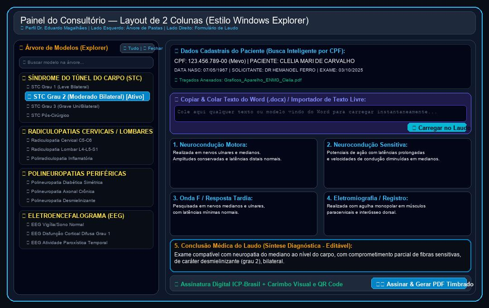

# Relatório de Acompanhamento, Requisitos & Roteiro de Uso
**Cliente:** Dr. Eduardo Magalhães — Clínica de Neurologia & Neurofisiologia  
**Data da Documentação:** 22/09/2026  
**Identificador:** DOC-2026-09-22  
**Desenvolvimento:** HelpUS Technology  
**Plataforma Web:** [neuro.eduardomagalhaes.helpusbr.com](https://neuro.eduardomagalhaes.helpusbr.com)

---

## PARTE 1: SOLICITAÇÕES E MATERIAIS DISPONIBILIZADOS PELO CLIENTE

### 1.1. Contexto das Solicitações via WhatsApp (22/09/2026)
Em comunicação enviada pelo **Dr. Eduardo Magalhães** na data de hoje (**22/09/2026**), o médico aprovou a melhoria das notificações e solicitou um ajuste de **diagramação da página do painel de laudos**:

> **Palavras e Solicitação do Dr. Eduardo:**  
> *"Verifiquei e as notificações já melhoraram bastante. O que eu gostaria que você ajudasse seria a diagramação da página para que a árvore de modelos ficasse do lado esquerdo e os campos de edição ficassem do lado direito de modo que eu não precisasse rolar a tela. A árvore de modelos fica melhor para mim se todas as subpastas estiverem visíveis simultaneamente do mesmo modo que fica na janela do Windows."*

### 1.2. Quadro Consolidado de Requisitos do Sistema

| ID | Solicitação do Dr. Eduardo | Solução Técnica Implementada | Status |
| :--- | :--- | :--- | :---: |
| **REQ-01** | Catálogo de 126 modelos de laudos (ENMG e EEG). | Organizado em 10 categorias com busca instantânea. | **Concluído** |
| **REQ-02** | Papel Timbrado e Assinatura Digital com QR Code. | PDF Oficial com selo PAdES ICP-Brasil e QR Code. | **Concluído** |
| **REQ-03** | Portal do Paciente para download seguro. | Download de PDF + Traçados mediante autenticação de CPF. | **Concluído** |
| **REQ-04** | Disparo de links via WhatsApp para pacientes. | Botão de envio instantâneo pré-formatado. | **Concluído** |
| **REQ-05** | Integração com Banco Winsoft (Jean Cordeiro). | Cadastro unificado de pacientes com importação CSV. | **Concluído** |
| **REQ-06** | Busca Inteligente por CPF (Estilo Mevo). | Preenchimento automático de dados cadastrais ao digitar CPF. | **Concluído** |
| **REQ-07** | Anexo de Arquivos de Traçados do Aparelho. | Módulo de vinculação de exames gráficos ao prontuário. | **Concluído** |
| **REQ-08** | Navegação por Pastas idêntica ao Google Drive. | Árvore expansível de diretórios e busca por palavra-chave. | **Concluído** |
| **REQ-09** | Autenticação de Usuários & Níveis de Acesso (RBAC). | Login seguro com perfis diferenciados (Médico vs Secretária). | **Concluído** |
| **REQ-10** | Sigilo Diagnóstico e Proteção LGPD na Recepção. | Corpo do laudo e conclusões ocultas para perfil de secretária. | **Concluído** |
| **REQ-11** | Edição Integral dos 5 Blocos do Corpo do Laudo. | Liberdade total de edição em Neurocondução, Onda F, EMG e Conclusão. | **Concluído** |
| **REQ-12** | Copiar & Colar / Importador de Texto Livre do Word (.docx). | Área dedicada para colar qualquer texto do Word e carregar no laudo. | **Concluído** |
| **REQ-13** | **Layout 2 Colunas (Windows Explorer) sem Scroll.** | Árvore de pastas expandida à esquerda + Formulário à direita. | **Concluído (22/09/2026)** |

---

## PARTE 2: FUNCIONALIDADES IMPLEMENTADAS EM PRODUÇÃO

### 2.1. Diagramação Split-Screen em 2 Colunas — REQ-13
- **Layout de 2 Colunas Lado a Lado:**
  - **Coluna da Esquerda (`lg:col-span-4`):** Árvore de navegabilidade de modelos estilo Windows Explorer.
  - **Coluna da Direita (`lg:col-span-8`):** Formulário completo do laudo (Dados do paciente, Importador do Word, 5 blocos do laudo e botões de ação).
- **Sem Necessidade de Rolagem Excessiva:** O modal foi expandido na tela (`max-w-[96vw] xl:max-w-7xl`), permitindo visualizar a árvore de modelos e o formulário de edição simultaneamente.

### 2.2. Árvore de Pastas no Estilo Windows Explorer
- **Subpastas Visíveis Simultaneamente:** Todas as pastas e subpastas da biblioteca (STC, Radiculopatias, Polineuropatias, Miopatias, EEG Normal e Alterado) vêm expandidas por padrão.
- **Botões de Controle de Expansão:** Adicionados os botões **"📂 Tudo"** (para expandir todas as subpastas) e **"📁 Fechar"** (para recolher tudo).
- **Indicador de Modelo Selecionado:** O modelo ativo fica destacado em verde/cyan na árvore com o ícone de arquivo `.docx`.

---

## PARTE 3: ROTEIRO PASSO A PASSO DE USO (GUIA PRÁTICO COM SCREENS)

### 1️⃣ Passo 1: Acesso ao Painel e Visualização em 2 Colunas
Acesse o sistema em **neuro.eduardomagalhaes.helpusbr.com** e faça login com as credenciais do **Dr. Eduardo Magalhães**. O painel abrirá diretamente na nova diagramação de **2 colunas side-by-side**.

*Figura 1: Nova interface em 2 colunas com a árvore estilo Windows Explorer à esquerda e o formulário de laudos à direita.*

### 2️⃣ Passo 2: Seleção de Modelos na Árvore Expandida (Esquerda)
No lado esquerdo, todas as pastas e subpastas estão abertas simultaneamente. Clique sobre qualquer modelo (ex: *STC Grau 2 Moderado*) para carregar instantaneamente o texto correspondente no formulário do lado direito.

### 3️⃣ Passo 3: Preenchimento do Laudo & Importador do Word (Direita)
No lado direito, digite o CPF do paciente para buscar no banco Winsoft/Mevo ou cole trechos de arquivos `.docx` na caixa **"📋 Copiar & Colar Texto do Word"**.

### 4️⃣ Passo 4: Assinatura Digital ICP-Brasil & Emissão do PDF
Revise os 5 blocos do laudo e clique no botão azul **"🖨️ Assinar & Gerar PDF Timbrado"** para emitir o documento oficial com papel timbrado da clínica, carimbo médico e QR Code.

---

## CONCLUSÃO & PRÓXIMOS PASSOS
Todas as solicitações apresentadas pelo **Dr. Eduardo Magalhães** em 22/09/2026 foram desenvolvidas, integradas e publicadas na plataforma web. O sistema encontra-se atualizado e disponível para produção em **[neuroeduardomagalhaes.vercel.app](https://neuroeduardomagalhaes.vercel.app)**.
