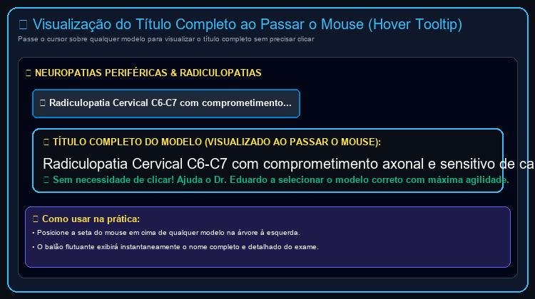
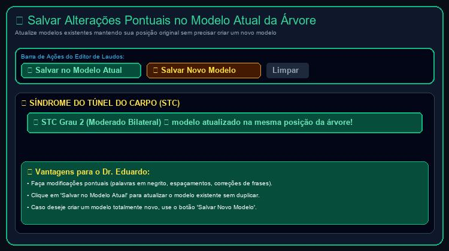
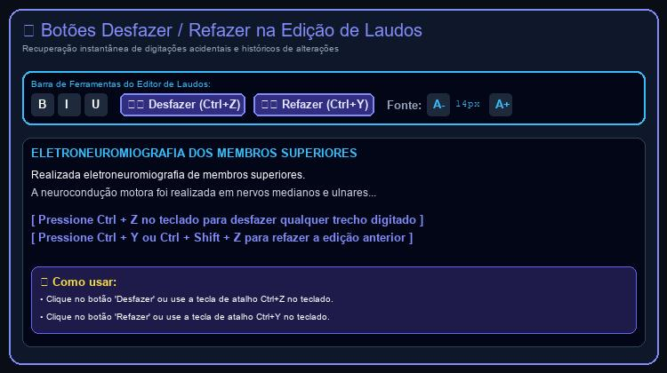
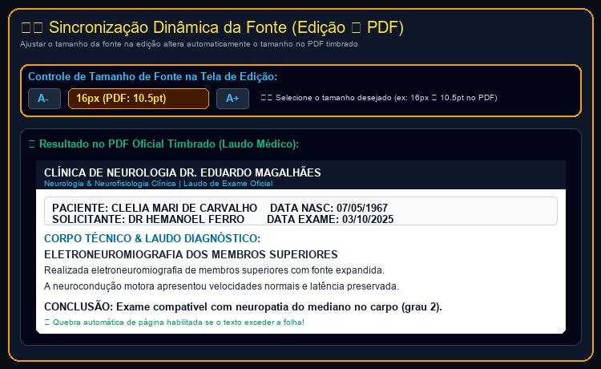

# RELATÓRIO DE ACOMPANHAMENTO & ROTEIRO DE USO (24/09/2026)
**Clínica de Neurologia Dr. Eduardo Magalhães**

---

### 📋 Informações Gerais
- **Cliente:** Dr. Eduardo Magalhães
- **Data da Rodada:** 24/09/2026
- **Identificador:** DOC-2026-09-24
- **Status:** Concluído & Publicado em Produção (Vercel)
- **Desenvolvimento:** HelpUS Technology
- **Links de Produção:**
  - Domínio Principal: [https://neuro.eduardomagalhaes.helpusbr.com](https://neuro.eduardomagalhaes.helpusbr.com)
  - Espelho Vercel: [https://neuroeduardomagalhaes.vercel.app](https://neuroeduardomagalhaes.vercel.app)

---

### 1. PARTE 1: NOVAS SOLICITAÇÕES DO DR. EDUARDO MAGALHÃES (24/09/2026)

Registro das solicitações enviadas pelo **Dr. Eduardo Magalhães** no dia **24/09/2026**:
1. *"Colocar um botão desfazer, refazer na tela de edição de laudos."*
2. *"E eu aumentei o tamanho da fonte na edição mas na geração do pdf nao mudou."*
3. *"Ao abrir um modelo qualquer caso queira fazer uma modificação pontual como por exemplo colocar uma palavra em negrito ou aumentar um espaçamento e manter o modelo na árvore na sua posição original apenas salvando as alterações, sem ter que salvar como um novo modelo."*
4. *"Ao passar o mouse sem clicar em cima de modelo específico, o título inteiro do modelo poderia aparecer, sem que precisasse clicar. Isso ajuda a selecionar o modelo correto com mais agilidade."*

#### Tabela de Requisitos e Resoluções de 24/09/2026:

| ID | Solicitação do Dr. Eduardo | Solução Técnica Implementada | Status |
|:---|:---|:---|:---|
| **REQ-22** | **Botões Desfazer / Refazer no Editor de Laudos** | Adicionados os botões **[Desfazer]** (↩️) e **[Refazer]** (↪️) na barra de ferramentas do editor de laudos, com suporte completo a histórico e teclas de atalho **Ctrl + Z** e **Ctrl + Y** (ou **Ctrl + Shift + Z**). | **Concluído (24/09)** |
| **REQ-23** | **Tamanho de Fonte Selecionado Refletido no PDF Timbrado** | Sincronização dinâmica entre a fonte configurada no editor (`editorFontSize` de 11px a 20px) e o tamanho da fonte gerada no PDF oficial (`pdfBodyFontSize` proporcional de 7.2pt a 13.1pt) com altura de linha dinâmica e suporte a quebra automática de páginas (`doc.addPage()`). | **Concluído (24/09)** |
| **REQ-24** | **Salvar Alterações Pontuais no Modelo Atual da Árvore** | Adicionado o botão **[💾 Salvar no Modelo Atual]** que grava edições pontuais (palavras em negrito, espaçamentos, correções de frases) diretamente no modelo selecionado, mantendo a sua posição original na árvore sem precisar criar um novo modelo. | **Concluído (24/09)** |
| **REQ-25** | **Visualização do Título Completo ao Passar o Mouse (Hover Tooltip)** | Adicionado balão flutuante inteligente (`Hover Popover Tooltip`) e atributo de acessibilidade nativo (`title`) ao passar o ponteiro do mouse sobre qualquer modelo da árvore, exibindo o título 100% completo do exame sem necessidade de clicar. | **Concluído (24/09)** |

---

### 2. PARTE 2: IMPLEMENTAÇÕES E COMPONENTES DESENVOLVIDOS

#### 2.1. Botões Desfazer / Refazer (Undo/Redo) com Histórico & Atalhos (REQ-22)
- **Pilha de Histórico (`reportHistory`):** Todas as digitações no editor, seleções de novos modelos na árvore, edições parciais, limpezas e importações do Word agora gravam estados sucessivos no histórico.
- **Botões Visuais:** Na barra de ferramentas superior do editor de laudo único foram incluídos os botões **Desfazer (Ctrl+Z)** e **Refazer (Ctrl+Y)**. Os botões ficam ativos ou desabilitados automaticamente conforme haja estados anteriores ou posteriores no histórico.
- **Teclas de Atalho de Teclado:** Integrados atalhos nativos no campo de texto (`onKeyDown`):
  - `Ctrl + Z` (ou `Cmd + Z` no Mac): Desfaz a última alteração.
  - `Ctrl + Y` ou `Ctrl + Shift + Z`: Refaz a alteração desfeita.

#### 2.2. Fonte Dinâmica no PDF & Quebra Automática de Página (REQ-23)
- **Sincronização Proporcional:** Ao alterar o tamanho da fonte na tela de edição (ex: de `13px` padrão para `15px`, `16px`, `18px`), o gerador de PDF (`jsPDF`) calcula a proporção exata para o documento impresso (`pdfBodyFontSize = 8.5 * (editorFontSize / 13)`).
- **Indicador Visual na Tela:** A barra de ferramentas agora exibe em tempo real o tamanho em pixels e a visualização do tamanho no PDF (ex: `16px (PDF: 10.5pt)`).
- **Tratamento Multi-Páginas:** Se a fonte for aumentada ou o laudo for longo e o texto ultrapassar os limites da página, a função `doc.addPage()` adiciona novas páginas automaticamente com cabeçalho limpo, evitando que qualquer texto seja cortado ou ultrapasse a margem inferior da folha.

#### 2.3. Salvar Alterações no Próprio Modelo da Árvore (REQ-24)
- **Atualização In-Place (`templateOverrides`):** Ao fazer alterações no texto do laudo (como colocar palavras em negrito com os botões `B`, `I`, `U` ou ajustar espaçamentos), basta clicar no botão **[💾 Salvar no Modelo Atual]**. As modificações são salvas no modelo em sua posição original na árvore.
- **Opção de Salvar Como Novo Modelo:** O botão **[➕ Salvar Novo Modelo]** continua disponível caso o médico deseje criar uma cópia ou modelo inédito em vez de sobrescrever o modelo ativo.

#### 2.4. Visualização do Título Completo ao Passar o Mouse (REQ-25)
- **Visualização Instantânea Sem Clicar:** Ao posicionar o cursor sobre qualquer item da árvore de modelos, surge instantaneamente um balão de pré-visualização em destaque exibindo o nome completo do laudo (sem cortes por `...`), permitindo seleção rápida e precisa pelo médico.

#### 2.5. Suporte Completo a Idiomas (PT, EN, ES)
- Todas as novas funcionalidades e etiquetas da barra de ferramentas foram traduzidas em **Português 🇧🇷**, **English 🇺🇸** e **Español 🇪🇸**.

---

### 3. PARTE 3: ROTEIRO PASSO A PASSO DE USO COM CAPTURAS DE TELA

#### Passo 1: Visualizar Título Completo do Modelo sem Clicar (REQ-25)
1. Posicione o cursor do mouse em cima de qualquer modelo na árvore à esquerda.
2. O balão flutuante exibirá instantaneamente o título 100% completo do exame, facilitando a identificação imediata.

*Figura 1: Balão flutuante (Hover Tooltip) exibindo o título completo do modelo ao passar o cursor sem necessidade de clicar.*

---

#### Passo 2: Salvar Alterações no Modelo Atual da Árvore (REQ-24)
1. Selecione um modelo qualquer na árvore (ex: *STC Grau 2 Moderado Bilateral*).
2. Faça as modificações desejadas no texto (ex: selecione uma palavra e clique em **B** para negrito ou adicione um parágrafo de observação).
3. Clique no botão verde **[💾 Salvar no Modelo Atual]** na barra de ferramentas.
4. O modelo permanecerá na mesma pasta e posição na árvore, agora com as suas modificações gravadas!

*Figura 2: Botão [Salvar no Modelo Atual] para atualizar o modelo existente mantendo sua posição original na árvore.*

---

#### Passo 3: Como Utilizar os Botões Desfazer e Refazer (Ctrl+Z e Ctrl+Y)
1. Abra o **Painel do Consultório** e acesse a tela de **Emissão de Laudos**.
2. Digite ou modifique o texto do laudo. Caso queira reverter uma alteração ou apagamento acidental, clique no botão **[Desfazer]** na barra de ferramentas ou pressione **Ctrl + Z** no seu teclado.
3. Se quiser restaurar o texto desfeito, clique no botão **[Refazer]** ou pressione **Ctrl + Y** (ou **Ctrl + Shift + Z**).

*Figura 3: Botões Desfazer (Ctrl+Z) e Refazer (Ctrl+Y) ativos na barra de ferramentas do editor de laudos.*

---

#### Passo 4: Como Ajustar o Tamanho da Fonte na Edição e Ver o Resultado no PDF
1. Na barra de ferramentas do editor de laudos, clique nos botões **A-** ou **A+** para ajustar o tamanho da fonte (ex: 14px, 16px, 18px).
2. Note o indicador em amarelo mostrando o tamanho correspondente no PDF timbrado (ex: `16px (PDF: 10.5pt)`).
3. Ao clicar em **[Assinar & Gerar PDF Timbrado]**, o laudo em PDF será gerado com o mesmo tamanho de fonte ampliado e com quebra de página automática caso necessário.

*Figura 4: Ajuste de tamanho de fonte no editor refletido instantaneamente na geração do PDF timbrado.*

---

### 4. PARTE 4: VALIDAÇÃO & DEPLOY EM PRODUÇÃO

- **Compilação Vite/React:** Executada com sucesso sem erros (`npm run build`).
- **Deploy na Vercel:** Atualizado e ativo nos endereços oficiais:
  - 🔗 [https://neuro.eduardomagalhaes.helpusbr.com](https://neuro.eduardomagalhaes.helpusbr.com)
  - 🔗 [https://neuroeduardomagalhaes.vercel.app](https://neuroeduardomagalhaes.vercel.app)
