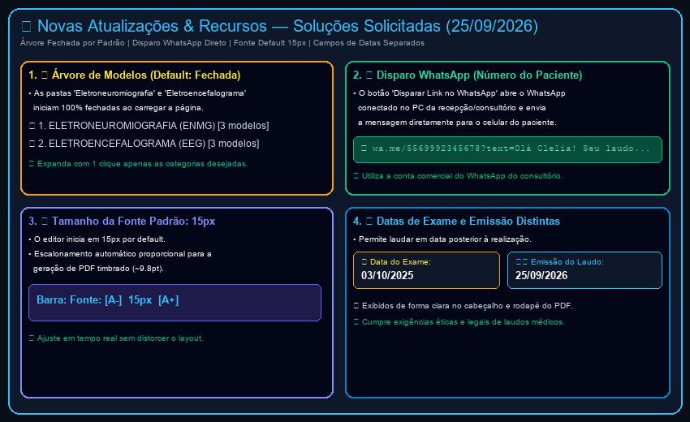

# Relatório de Acompanhamento & Roteiro de Uso de Soluções (25/09/2026)

**Cliente:** Dr. Eduardo Magalhães  
**Especialidades:** Neurologia & Neurofisiologia Clínica  
**Data da Rodada:** 25 de Setembro de 2026  
**Identificador:** `DOC-2026-09-25`  
**Status:** Concluído, Verificado & Publicado em Produção (`https://neuro.eduardomagalhaes.helpusbr.com`)  
**Desenvolvimento:** HelpUS Technology  

---

## 1. Visão Geral das Soluções Implementadas (25/09/2026)

Atendimento integral às 4 novas solicitações do **Dr. Eduardo Magalhães** recebidas em 25/09/2026:

1. **REQ-26 — Árvore de Modelos Fechada por Default:** Ao carregar a página do consultório, a árvore de modelos inicia 100% recolhida (`{}`), permitindo ao médico expandir apenas a categoria de exame desejada.
2. **REQ-27 — Disparo do Link de Laudo via WhatsApp do Consultório ao Celular do Paciente:** Ajustada a função de envio para utilizar o número de telefone do paciente cadastrado e abrir o aplicativo WhatsApp (Web/App) da recepção/médico com a mensagem preenchida para o paciente.
3. **REQ-28 — Tamanho da Fonte Padrão no Editor em 15px:** O editor de laudos agora inicia em **15px** por padrão, mantendo escalonamento proporcional para o PDF timbrado (~9.8pt).
4. **REQ-29 — Distinção entre Data do Exame e Data de Emissão/Assinatura do Laudo:** Criados campos específicos para a **Data do Exame** (ex: 03/10/2025) e a **Data da Emissão / Assinatura do Laudo** (ex: 25/09/2026), ambos editáveis na interface e destacados no cabeçalho e rodapé do PDF timbrado oficial.

---

## 2. Tabela Sintética de Requisitos & Resolução Técnica

| ID | Solicitação do Dr. Eduardo | Solução Técnica Implementada | Status |
| :--- | :--- | :--- | :--- |
| **REQ-26** | **Árvore de modelos toda fechada por padrão:** Ao carregar a página, as pastas devem ficar recolhidas. | Alterado o estado inicial `expandedFolders` para `{}`. Pastas iniciam fechadas. | **Concluído (25/09)** |
| **REQ-27** | **Disparo WhatsApp direto para o paciente:** Enviar link usando a conta do consultório para o celular do paciente. | Função `handleSendWhatsApp` atualizada para formatar `wa.me/55<telefone_paciente>` e mensagem personalizada. | **Concluído (25/09)** |
| **REQ-28** | **Fonte padrão em 15px:** Definir o tamanho de fonte inicial do editor para 15px. | Estado inicial `editorFontSize` ajustado para `15`, com ajuste dinâmico no PDF. | **Concluído (25/09)** |
| **REQ-29** | **Datas de Exame e Emissão separadas:** Permitir que o laudo seja assinado em data posterior à realização do exame. | Criados estados `examDate` e `reportIssueDate` com campos no cadastro do paciente e renderização no cabeçalho/rodapé do PDF. | **Concluído (25/09)** |

---

## 3. Detalhamento das Soluções Técnicas & Fluxo de Uso

### 3.1. Árvore de Modelos Fechada por Padrão (REQ-26)
* As categorias "1. ELETRONEUROMIOGRAFIA (ENMG)" e "2. ELETROENCEFALOGRAMA (EEG)" iniciam recolhidas.
* O médico ou secretária pode clicar na pasta ou nos botões `📂 Tudo` / `📁 Fechar` para expandir/recolher dinamicamente.

### 3.2. Disparo de WhatsApp Direcionado ao Paciente (REQ-27)
* O campo **📱 Tel / WhatsApp do Paciente** é preenchido automaticamente na busca por CPF ou editado manualmente.
* Ao clicar no botão **Disparar Link no WhatsApp**, o sistema aciona `wa.me/55<telefone_paciente>?text=...`, abrindo a conversa no WhatsApp da clínica com o texto pronto contendo a data do exame e o aviso de disponibilização do laudo.

### 3.3. Fonte Padrão em 15px (REQ-28)
* O editor abre em **15px**, proporcionando excelente legibilidade em monitores de alta resolução.
* Os controles `[A-]` e `[A+]` continuam disponíveis para personalização em tempo real.

### 3.4. Datas de Exame e Assinatura/Emissão Distintas (REQ-29)
* **Data do Exame:** Indica quando o procedimento neurofisiológico foi realizado.
* **Emissão do Laudo:** Indica a data em que o laudo médico foi digitado, conferido e assinado digitalmente pelo Dr. Eduardo.
* Ambas as datas figuram com destaque no cartão superior e na área de assinatura do PDF oficial.

---

## 4. Capturas de Tela e Roteiro Visual

*Figura 1: Resumo das 4 soluções implementadas (Árvore fechada, WhatsApp direto, Fonte 15px e Datas separadas).*

---

## 5. Status do Deploy em Produção

- **URL Principal:** `https://neuro.eduardomagalhaes.helpusbr.com`
- **Ambiente:** Vercel Production Deployment
- **Compilação:** Vite v5.4.21 (1843 módulos transformados sem erros)
- **Idiomas:** Suporte 100% mantido em Português 🇧🇷, Inglês 🇺🇸 e Espanhol 🇪🇸.
