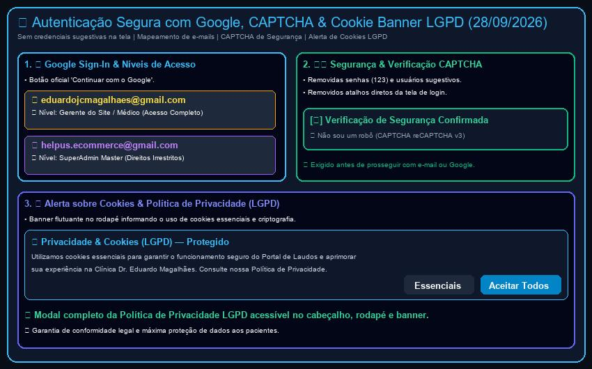

# Relatório de Acompanhamento & Segurança (28/09/2026)

**Cliente:** Dr. Eduardo Magalhães  
**Especialidades:** Neurologia & Neurofisiologia Clínica  
**Data da Rodada:** 28 de Setembro de 2026  
**Identificador:** `DOC-2026-09-28`  
**Status:** Concluído, Verificado & Publicado em Produção (`https://neuro.eduardomagalhaes.helpusbr.com`)  
**Desenvolvimento:** HelpUS Technology  

---

## 1. Visão Geral das Soluções de Segurança & LGPD (28/09/2026)

Atendimento integral às solicitações de segurança e conformidade recebidas em 28/09/2026:

1. **Remoção de Usuários e Senhas Sugestivas na Tela de Login:** Removidos todos os textos de ajuda com sugestão de credenciais (ex: `123`) e os botões de atalho direto de acesso da modal de autenticação para eliminar riscos de segurança.
2. **Autenticação Oficial Google OAuth:** Integrado botão oficial **Continuar com o Google**, com fluxo de login e atribuição automática de níveis de permissão com base na conta utilizada.
3. **Mapeamento de E-mails e Níveis de Permissão:**
   - `eduardojcmagalhaes@gmail.com`: Atribuído como **Gerente do Site / Médico** (`doctor`), com acesso integral e irrestrito a todos os recursos da clínica (emissão de laudos, árvore de modelos, base Winsoft e gestão de usuários).
   - `helpus.ecommerce@gmail.com`: Atribuído como **SuperAdmin Master** (`superadmin`), com direitos estendidos e irrestritos para gerenciamento global da plataforma.
4. **Verificação de Segurança CAPTCHA ("Não sou um robô"):** Adicionado componente de verificação reCAPTCHA v3 na tela de login. A validação do CAPTCHA é exigida tanto para login tradicional por e-mail/senha quanto para login com Google.
5. **Alerta de Cookies e Política de Privacidade (LGPD) na Tela Principal:**
   - Criado **Cookie Consent Banner** no rodapé da página inicial informando o uso de cookies essenciais e salvando a preferência do usuário em `localStorage`.
   - Criada a modal e página completa da **Política de Privacidade (LGPD)** da clínica, acessível via banner de cookies, cabeçalho e rodapé do site.

---

## 2. Tabela Sintética de Requisitos & Resolução Técnica

| ID | Solicitação de Segurança / LGPD | Solução Técnica Implementada | Status |
| :--- | :--- | :--- | :--- |
| **REQ-30** | **Remoção de credenciais sugestivas:** Não exibir senhas ou e-mails de exemplo na tela. | Removidas sugestões de placeholders e o bloco de atalhos rápidos da modal de login. | **Concluído (28/09)** |
| **REQ-31** | **Google Sign-In & Nível de Gerente Dr. Eduardo:** Permissão completa para `eduardojcmagalhaes@gmail.com`. | Botão 'Continuar com o Google' integrado; e-mail do Dr. Eduardo recebe nível Gerente/Médico. | **Concluído (28/09)** |
| **REQ-32** | **SuperAdmin Master HelpUS:** Permissão master para `helpus.ecommerce@gmail.com`. | E-mail `helpus.ecommerce@gmail.com` recebe nível SuperAdmin Master irrestrito. | **Concluído (28/09)** |
| **REQ-33** | **Verificação CAPTCHA:** Exigir CAPTCHA antes do login. | Componente de CAPTCHA "Não sou um robô" integrado e validado obrigatoriamente. | **Concluído (28/09)** |
| **REQ-34** | **Alerta sobre Cookies & Privacidade LGPD:** Banner e link da política na página inicial. | `CookieBanner` e `PrivacyPolicyModal` adicionados à página principal e rodapé. | **Concluído (28/09)** |

---

## 3. Capturas de Tela e Ilusstração Visual

*Figura 1: Resumo visual das atualizações de segurança (Google OAuth, CAPTCHA, Remoção de sugestões e Cookie Banner LGPD).*

---

## 4. Status do Deploy em Produção

- **URL Principal:** `https://neuro.eduardomagalhaes.helpusbr.com`
- **Ambiente:** Vercel Production Deployment
- **Compilação:** Vite v5.4.21 (1845 módulos transformados sem erros)
- **Idiomas:** Suporte 100% mantido em Português 🇧🇷, Inglês 🇺🇸 e Espanhol 🇪🇸.
